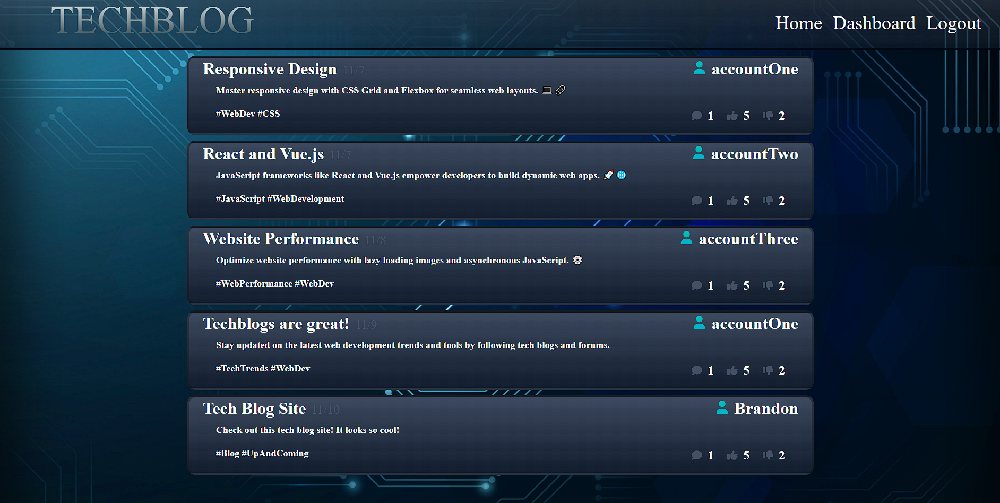

[![Contributors][contributors-shield]][contributors-url]
[![Forks][forks-shield]][forks-url]
[![Stargazers][stars-shield]][stars-url]
[![Issues][issues-shield]][issues-url]
[![MIT License][license-shield]][license-url]
[![LinkedIn][linkedin-shield]][linkedin-url]

<!-- PROJECT LOGO -->
 

  

<h3 align="center">Brandon Barnes</h3>

  

Learn something today with out intuitive Tech-Blog! Create, Read, Update and Delete your findings on your personal account for others to see.

-Join the community today!

  

 
 

<h3 font size="1" align="right"><a href="https://warm-tor-21713-78158b52f6f4.herokuapp.com/" target="_blank">Visit Site🚀</a></h3>

## Table of Contents

<!-- TABLE OF CONTENTS -->

  
Table of Contents

  <ol>
    <li><a href="#tech-stack">Tech Stack</a></li>
    <li><a href="#contact">Contact</a></li>0
    <li><a href="#contribution">Contact</a></li>
  </ol>

## Tech Stack

## Sneak Peek

### <a href="https://frozen-atoll-50756-6fc6938823dd.herokuapp.com/" target="_blank">Visit Site</a> 🚀

(<a href="#readme-top">back to top</a>)

## Contribution

<h3> Jared
<h4> Github - <a href="https://github.com/jradmorrison">jradmorrison</a></h4>

## Contact

<h4>Twitter - <a href="https://twitter.com/ThatZiro">@ThatZiro</a></h4>
<h4>Email - <a href="mailto:ImBrandonBarnes@gmail.com">ImBrandonBarnes@gmail.com</a></h4>
<h4>Github - <a href="https://github.com/ThatZiro">ThatZiro</a></h4>
<h4>Linkedin - <a href="https://www.linkedin.com/in/brandon-barnes-4b2098232/">Brandon Barnes</a></h4>

(<a href="#readme-top">back to top</a>)

<!-- MARKDOWN LINKS & IMAGES -->
<!-- https://www.markdownguide.org/basic-syntax/#reference-style-links -->

[contributors-shield]: https://img.shields.io/github/contributors/ThatZiro/Tech-Blog.svg?style=for-the-badge
[contributors-url]: https://github.com/ThatZiro/Tech-Blog/graphs/contributors
[forks-shield]: https://img.shields.io/github/forks/ThatZiro/Tech-Blog.svg?style=for-the-badge
[forks-url]: https://github.com/ThatZiro/Tech-Blog/network/members
[stars-shield]: https://img.shields.io/github/stars/ThatZiro/Tech-Blog.svg?style=for-the-badge
[stars-url]: https://github.com/ThatZiro/Tech-Blog/stargazers
[issues-shield]: https://img.shields.io/github/issues/ThatZiro/Tech-Blog.svg?style=for-the-badge
[issues-url]: https://github.com/ThatZiro/Tech-Blog/issues
[license-shield]: https://img.shields.io/github/license/ThatZiro/Tech-Blog.svg?style=for-the-badge
[license-url]: https://github.com/ThatZiro/Tech-Blog/blob/master/LICENSE.txt
[linkedin-shield]: https://img.shields.io/badge/-LinkedIn-black.svg?style=for-the-badge&logo=linkedin&colorB=555
[linkedin-url]: https://linkedin.com/in/linkedin_username
